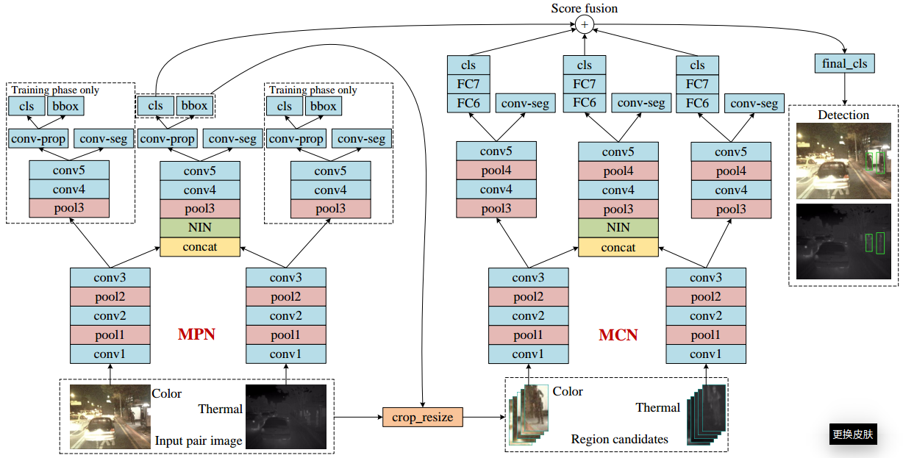
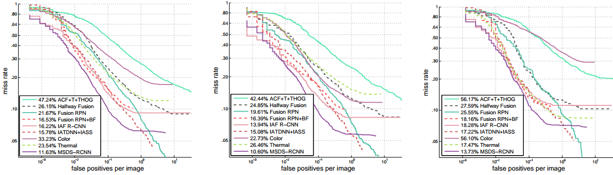

### Multispectral Pedestrian Detection via Simultaneous Detection and Segmentation
Edited by Chengyang Li, Zhejiang University.

Demo code of our paper [Multispectral Pedestrian Detection via Simultaneous Detection and Segmentation](https://arxiv.org/abs/1808.04818) by Chengyang Li, Dan Song, Ruofeng Tong and Min Tang. BMVC 2018. [[project link]](https://li-chengyang.github.io/home/MSDS-RCNN/).



### Demo
0. Prerequisites

　Basic Tensorflow and Python package installation.
  
　This code is tested on [Ubuntu14.04, tf1.2, Python2.7] and [Ubuntu16.04, tf1.11, Python3.5].

1. Clone the repository
  ```Shell
  git clone https://github.com/Li-Chengyang/MSDS-RCNN.git
  ```

2. Update your -arch in setup script to match your GPU
  ```Shell
  cd msds-rcnn/lib
  # Change the GPU architecture (-arch) if necessary
  vim setup.py
  ```

3. Build the Cython modules
  ```Shell
  make clean
  make
  cd ..
  ```

4. Download the pre-trained model

　VGG16 model [[One driver]](https://1drv.ms/u/s!AtMRVLTL5T5eb5_kGuk3AZxDT4o) trained on KAIST using original training annotaions.
  ```Shell
  # Untar files to output/vgg16/
  cd output/vgg16
  tar -xvf pretrained_model.tar
  ```
  
5. Run demo 
  ```Shell
  python tools/demo.py
  ```

### Detection performance



**Note**: 
Since the original annotations of the test set contain many problematic bounding boxes, we use the [improved testing annotations](http://paul.rutgers.edu/%7Ejl1322/multispectral.htm) provided by Liu et al. to enable a reliable comparison.

### Downloads

[Human baseline](https://drive.google.com/open?id=1hNLSRPpQWRANf62kG58X6dI4uIMKwL3n)

[Sanitized training annotations](https://goo.gl/forms/Lfgd3vcx4ZrFxs0J3)

[Detection results](https://drive.google.com/open?id=1MLejnwZr7C1imUa9emyVJiUH5CxbYw-T)

### Acknowledgements

Thanks to Xinlei Chen, this pipeline is largely built on his example tensorflow Faster R-CNN code available at:
[https://github.com/endernewton/tf-faster-rcnn](https://github.com/endernewton/tf-faster-rcnn)

### Citing our paper
If you find our work useful in your research, please consider citing:

```
@article{li2018multispectral,
  title={Multispectral Pedestrian Detection via Simultaneous Detection and Segmentation},
  author={Li, Chengyang and Song, Dan and Tong, Ruofeng and Tang, Min},
  journal={arXiv preprint arXiv:1808.04818},
  year={2018}
}
```

